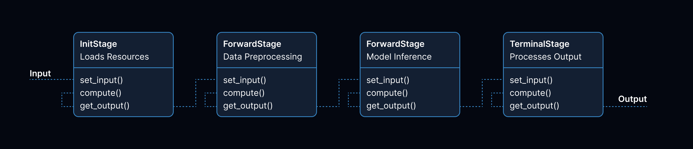

.. ror documentation master file, created by
   sphinx-quickstart on Sat Dec 23 09:03:59 2023.
   You can adapt this file completely to your liking, but it should at least
   contain the root `toctree` directive.

.. admonition:: Not in Stable Release
   :class: caution

   Warning! This project is not in stable release yet.

Welcome to ror!
======================================

   A simple example of a pipeline defined using the ror framework.

Overview
--------

Welcome to the **ror** project, which proposes a more customizable and flexible way to create
pipelines programmatically in Python. You can define simple forward propagating pipelines where the
input of the first stage is computed on and then passed to the next stage until you reach a terminal
stage. Which makes it easier to have a good separation of concern when constructing complex inference
logic in ML projects.

Key Features
------------

The current version of ror is **v0.1.0** and supports the following features:

* 🏗 **Forward Pipelines:** Supports simple forward passing pipelines with a separation of concern for each pipeline stage.
* 🚀 **Robust ML Pipelines Faster:** Parallelize the work of an entire pipeline by developing stages independently which can be linked at the end.
* 📚 **Readable ML Code:** Move away from massive ML Python files to using logically constructed code in the form of stages.

Benefits
--------

* **High-Readability**
* **Better Maintainability**
* **Enabling Better Collaboration**

Future Additions
----------------

* **Conditional Stages:** Based on the computation of some stage, the output can be directed to different sub-pipelines.
* **Caching InitStage:** Load your model/data once and cache such that it is not loaded for each pipeline inference.

Documentation Overview
----------------------

Contents
~~~~~~~~

.. toctree::
   :maxdepth: 1
   :caption: 🧑‍💻 User Documentation

   user_documentation/installation
   user_documentation/getting_started
   user_documentation/examples

.. toctree::
   :maxdepth: 2
   :caption: 📚 API Reference

   api_reference/ror

Indecies and Tables
~~~~~~~~~~~~~~~~~~~

* :ref:`genindex`
* :ref:`modindex`
* :ref:`search`
