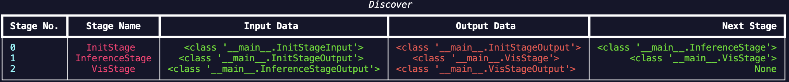
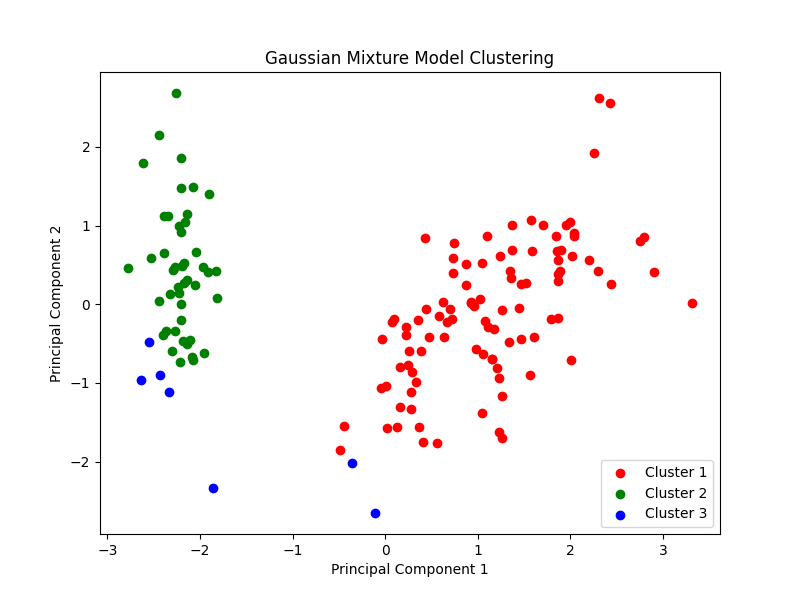

.. _examples:

Example
========

This tutorial will cover a very practical example of how **ror** can be applied to some inference pipeline.
For this case we will be using the simple Iris dataset from sklearn along with a GMM as our model.

.. admonition:: Use ror for more complex problems
   :class: tip

   ror is a great tool for managing a good seperation of concern in complex inferenece pipelines, however, for very
   simple problems such as the one presented on this page, it will only add more boiler-plate code which is not worth it for
   very simple problems.

Creating Schemas
----------------

We know that this problem requires three very simple stages; data loading and preprocessing, training/inference, and finally
some stage to visualise the results of our model. Based on this, we will be creating our pipeline, but first, we import
all the relevant modules for this tutorial.

.. code-block:: python
  :caption: Module Imports

  import matplotlib.pyplot as plt
  from sklearn import datasets
  from sklearn.mixture import GaussianMixture
  from sklearn.decomposition import PCA
  from sklearn.preprocessing import StandardScaler

  from dataclasses import dataclass
  from typing import Tuple

  from ror.schemas import BaseSchema
  from ror.schemas.fields import field_perishable, field_persistance
  from ror.stages import IInitStage, ITerminalStage, IForwardStage
  from ror.controlers import BaseController

Then we can define the data schemas. We know that we can simply load the Iris dataset from sklearn, and we should standardise
the dataset, so we account for this in our data schemas.

.. code-block:: python
  :caption: Data Schemas

  @dataclass
  class InitStageInput(BaseSchema):
      data: object = field_perishable()

  @dataclass
  class InitStageOutput(BaseSchema):
      X_pca: object = field_persistance()
      X_std: object = field_perishable()
      model: object = field_persistance()

  @dataclass
  class InferenceStageOutput(BaseSchema):
      X_pca: object = field_perishable()
      model: object = field_perishable()
      labels: object = field_persistance()

  @dataclass
  class VisStageOutput(BaseSchema):
      labels: object = field_persistance()

Note that we set some fields to be perishable, which prevents this data from being propagated through to the next stages
and we can simply ignore them after they have served their purpose. Additionally, we have the X_pca field such that we can
visualise the data at the end along two principal components.

Linking Stages
--------------

Based on these schemas we allready have a decent idea of how we should link the stages, and we can do this very simply using
the provided interfaces from **ror**.

.. code-block:: python
  :caption: Defining Stages

  class VisStage(ITerminalStage[InferenceStageOutput, VisStageOutput]):
      def compute(self) -> None:
          # Visualize the clusters
          plt.figure(figsize=(8, 6))
          colors = ['r', 'g', 'b']

          for i in range(3):
              plt.scatter(
                  self.input.X_pca[self.input.labels == i, 0],
                  self.input.X_pca[self.input.labels == i, 1],
                  color=colors[i],
                  label=f'Cluster {i+1}'
              )

          plt.title('Gaussian Mixture Model Clustering')
          plt.xlabel('Principal Component 1')
          plt.ylabel('Principal Component 2')
          plt.legend()
          plt.show()

          self._output = self.input.get_carry()

      def get_output(self) -> VisStageOutput:
          return VisStageOutput(**self._output)

  class InferenceStage(IForwardStage[InitStageOutput, InferenceStageOutput, VisStage]):
      def compute(self) -> None:
          # Fit Guassian mixture to dataset
          self.input.model.fit(self.input.X_std)

          # Predict the labels
          labels = self.input.model.predict(self.input.X_std)

          self._output = {
              "labels": labels,
              **self.input.get_carry()
          }

      def get_output(self) -> Tuple[VisStage, InferenceStageOutput]:
          return VisStage(), InferenceStageOutput(**self._output)

  class InitStage(IInitStage[InitStageInput, InitStageOutput, InferenceStage]):
      def compute(self) -> None:
          # Load the dataset
          X = self.input.data.data

          # Standardize the features
          scaler = StandardScaler()
          X_std = scaler.fit_transform(X)

          # Apply PCA to reduce dimensionality for visualization
          pca = PCA(n_components=2)
          X_pca = pca.fit_transform(X_std)

          # Fit a Gaussian Mixture Model
          gmm = GaussianMixture(n_components=3, random_state=42)

          self._output = {
              "X_pca": X_pca,
              "X_std": X_std,
              "model": gmm,
              **self.input.get_carry()
          }

      def get_output(self) -> Tuple[InferenceStage, InitStageOutput]:
          return InferenceStage(), InitStageOutput(**self._output)

Note that we define the stages in reverse order, this is just so that we can have the intermediate references
between stages. However, in a production setting the schemas and stages should be seperated into different files
which will make the code easier to maintain. When we then define the controller with some input data, we can
run the discover method to observe how our stages were linked.

.. code-block:: python
  :caption: Defining Pipeline Controller

  iris = datasets.load_iris()

  input_data = InitStageInput(data=iris)
  controller = BaseController(init_data=input_data, init_stage=InitStage)
  controller.discover()

Below you can see an example of the expected output when running the discover method on this pipeline.

   Output of running the discover method of the controller for the above pipeline.

Running the Pipeline
--------------------

Given that we have allready defined the controller with some input data. We can simply run the start method
of the controller to get the output and the final visualisation of the predictions for the GMM.

.. code-block:: python
  :caption: Running the Pipeline

  iris = datasets.load_iris()

  output, run_id = controller.start()

With this we should get the following output.

   Visualisation of the results from our GMM model defined with **ror**.

Congratulations you defined your first **ror**! As mentioned above this library is meant for more complex
inference pipelines, however, I hope this served as a gentle introduction into how **ror** works.
